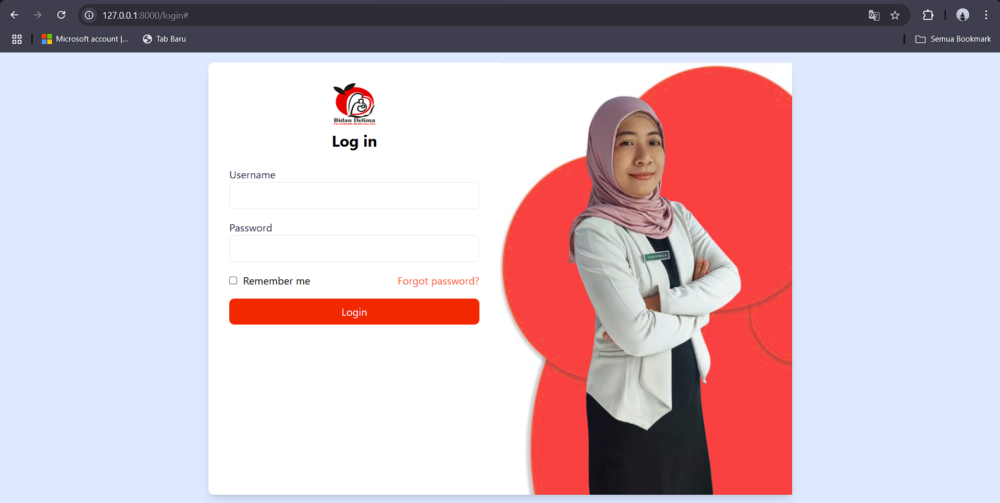
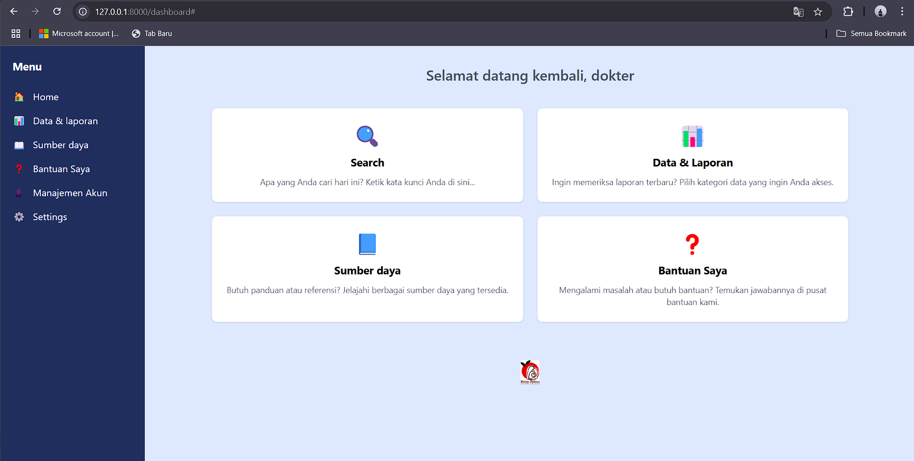
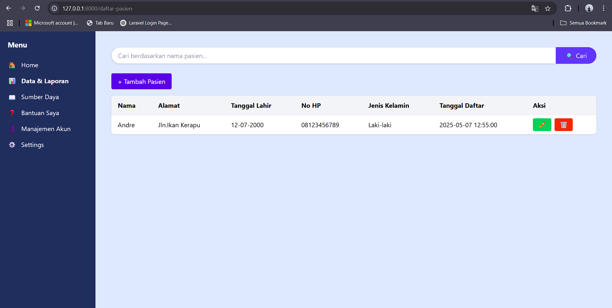
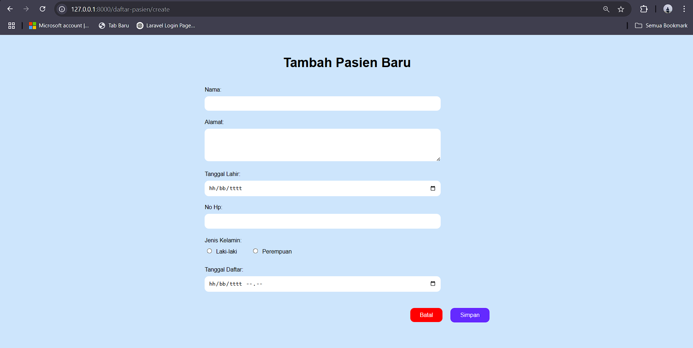
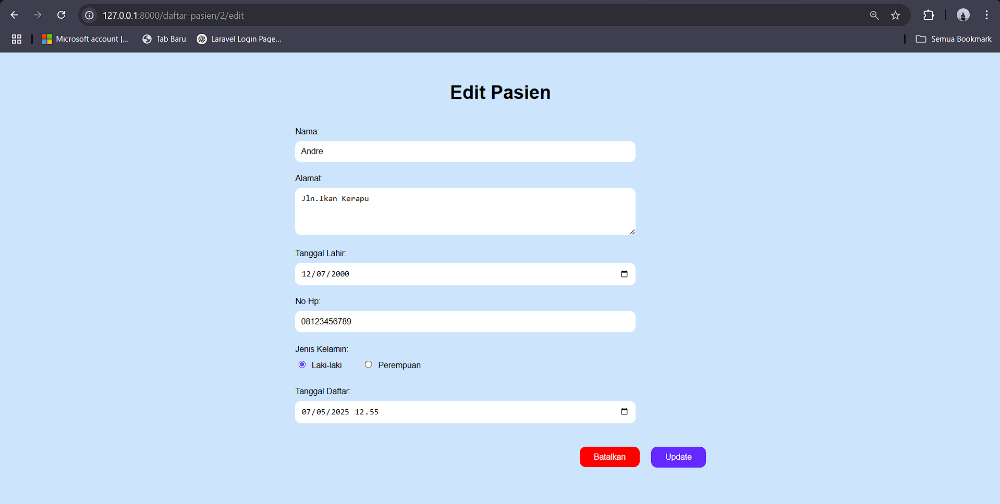

## Progress Scrum 1

# Login Page

Pada progress yang pertama ialah login page yang bisa diakses untuk bidan / admin untuk masuk ke akunnya agar dapat mengakses fitur / konten yang disediakan

Pada progress yang kedua adalah Halaman Dashboard yang bisa dilihat oleh bidan / admin untuk mengakses halaman2 yang telah dibuat oleh tim dan yang telah disepakati oleh kedua pihak
Setelahnya melanjutkan ke halaman Data & Laporan Jika Diklik akan melanjutkan ke navigasi progress yang selanjutnya

Pada progress yang ketiga ini adalah halaman untuk mengelola CRUD data2 untuk pasien yang berisikan nama, alamat, tanggal lahir, no hp, jenis kelamin, tanggal daftar serta akan ada tambahan untuk scrum selanjutnya yaitu data2 yang ada didalam pasien seperti riwayat sakit, dll

ini ialah halaman untuk menambahkan data2 pada pasien lalu akan masuk ke halaman daftar pasien yang diatas

dan ini adalah halaman untuk mengedit data2 pasien yang sudah ada supaya jika terjadi kesalahan datanya bisa diubah